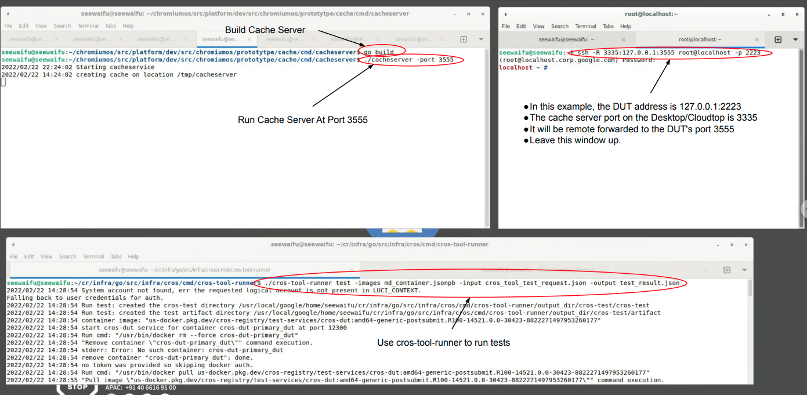

# Test cros-tool-runner Test Execution Flow Locally

This file provides instruction how to use cros-tool-runner to run test locally.

## Build:

$ cd <cr_infra>/go/src/infra/cros/cmd/cros-tool-runner
$ go build

A new executable called cros-tool-runner will be created in 
<cr_infra>/go/src/infra/cros/cmd/cros-tool-runner

## Build Local Cache Server:

# Inside chroot
$ cd <chromiumos_root>/src/platform/dev/src/chromiumos/prototytpe/cache/cmd/cacheserver
$ go build

A executable called cache server will be created in
<chromiumos_root>/src/platform/dev/src/chromiumos/prototytpe/cache/cmd/cacheserver

## Run Local Cache Server: cacheserver -port <port_num>

In the following example, a cache server will be listtening to port 3555
at your Desktop/Cloudtop.

```
$ ./cacheserver -port 3555
2022/02/17 19:05:27 Starting cacheservice
2022/02/17 11:05:27 creating cache on location /tmp/cacheserver
```

Note that you may need to first add default credentials to your chroot. If you
get permission errors in this step, do the following:

Either run `gcloud auth application-default login` or locate your existing
.json credentials file.

In your chroot, copy this file to an accessible location and update the env
variable GOOGLE_APPLICATION_CREDENTIALS pointing to it.


## Remote Forward The Cache Server Port To Your DUT

* In the example below, the DUT is 127.0.0.1:2223
* The cache server port on the Desktop/Cloudtop is 3335
* It will be remote forwarded to the DUT's port 3555
* Executables running in the DUT can use localhost:3555 to send requests
to the cache server running on Desktop/Cloudtop
* Leave this window on while you are running "cros-tool-runner test"

```
$ ssh -R 3335:127.0.0.1:3555 root@localhost -p 2223
(root@localhost.corp.google.com) Password:
localhost ~ #
```


## Download A Container Metadata File

* Download a container [metadata file](https://pantheon.corp.google.com/storage/browser/chromeos-image-archive/postsubmit-orchestrator;tab=objects?prefix=&forceOnObjectsSortingFiltering=true)
* Pick either the latest one or the build that you want to test on.

## Compose A Test Request

Example:

```
{"testSuites":[
    {
        "name":"suite1",
        "testCaseIds":
        {
            "testCaseIds":[
                {"value":"tast.example.Pass"},
                {"value":"tast.example.Fail"}
            ]
        }
    },
    {
        "name":"suite2","testCaseTagCriteria":
        {"tags":["group:meta"]}
    }],
    "primaryDut": {
        "dut": {
            "id": {"value":"primary_dut"},
        "chromeos": {
                "ssh": {"address":"127.0.0.1","port":2223}
            },
            "cacheServer": {
            "address": {"address":"127.0.0.1","port":3335}
            }
        },
        "containerMetadataKey":"amd64-generic"
    },
    "artifactDir":"output_dir"
}
```


# Run cros-tool-runner

Example:
```
./cros-tool-runner test -images md_container.jsonpb -input cros_tool_test_request.json -output test_result.json
```

* The md_container.jsonpb is a container metadata file downloaded earlier.
* The file cros_tool_test_request.json is the test request file.
* If the run was successful, you should see the test result in test_result.json,

Troubleshooting this step:

* Make sure you have been granted permission to pull images from test-services.
* Gcloud needs to be configured to run docker. Try `gcloud auth configure-docker us-docker.pkg.dev`.
* Make sure the image on your DUT matches the metadata image (or is at
  least close enough to avoid incompatibility).
* You will need to `sudo rm -rf output_dir/` between consecutive runs
of cros-tool-runner.

# Screenshot Of The Example



